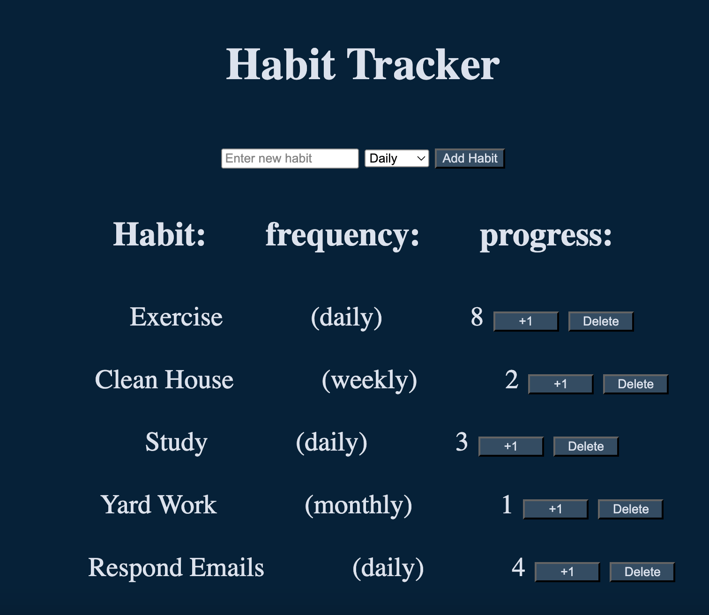

# Habit Tracker Web App

Welcome to the Habit Tracker app. I designed this tool to help stay on track with certain daily, weekly, or monthly tasks that I've struggled with accomplishing for myself. Whether it's exercising, cleaning the house, or checking emails daily, this app helps manage it all.

## Features

- Add Habits: Add new habits, and choose the frequency (daily, weekly, or monthly).
- Track Progress: Increment your habit progress with a +1 button.
- Delete Habits: Remove habits from your list when you no longer need them with a delete button.
- Night Mode: Switch to a darker theme using the backtick key ``(`)``.

## Habit Management

1. Add a Habit: Use the input form to add a new habit by entering a name and choosing the frequency (daily, weekly, or monthly). Click "Add Habit," and the habit will appear in the list.

2. Track Progress: Each habit shows a progress count. You can click the +1 button to update your progress and see your growth over time.

3. Delete a Habit: When you no longer need a habit, click the "Delete" button to remove it from the list.

## Setup and Installation

Follow these steps to get the Habit Tracker running in your browser.

### Step 1: Create a Folder for the App

**1.** Create a new folder on your computer where you want the Habit Tracker to reside. 
On Mac or Linux/Ubuntu, open Terminal, and type:
- `mkdir habit-tracker-app`

Then, navigate into the folder:
- `cd habit-tracker-app`

### Step 2: Fork and Clone the Repository from GitHub

**2.** Go to the GitHub page of the Habit Tracker repository.
   - On the GitHub page, click the Fork button at the top right of the page to create a copy of the repository under your own GitHub account.
   
**3.** After forking, you'll want to clone your forked repository to your local machine:
   - On the forked repository page, click the Code button (usually in green) and copy the SSH URL.
   
**4.** In your terminal or command prompt, navigate to the habit-tracker-app folder you created in Step 1, then run the following command to clone the repository:
   - `git clone git@github.com:YOUR_USERNAME/phase-1-Project.git`
      - **_Replace link with your SSH link_**

**5.** Navigate into the cloned folder:
   - `cd phase-1-Project`

### Step 3: Install json-server

**6.** The app uses json-server to manage a local database of your habits. If you don't have json-server installed globally, install it by running the following command:
   - `npm install -g json-server`

### Step 4: Run json-server

**7.** To start managing your habits data, run json-server in your habit-tracker directory with this command:
   - `json-server db.json`

### Step 5: Install live-server

**8.** The app uses live-server to serve the HTML and JavaScript files locally, and automatically reload changes in your browser. If you don't already have live-server installed, you can install it globally by opening a new terminal and running:
   - `npm install -g live-server`

### Step 6: Run live-server

**9.** After installing live-server, you can launch it in the new terminal by going to the habit-tracker directory and typing:
   - `live-server`

**10.** live-server should automatically open the app in your default browser. If for some reason it doesn't, manually visit http://127.0.0.1:8080 or http://localhost:8080 in your browser.

### Step 7: Start Using the App

**11.** Once the app is running in your browser, you can start adding habits, and tracking your progress.

## Dev tools

- **_HTML_**: For the structure of the app.
- **_CSS_**: For styling, including night mode support.
- **_JavaScript_**: To handle the functionality of the app (e.g., adding, updating, and deleting habits).
- **_json-server_**: A local backend for storing and retrieving habit data.
- **_live-server_**: A simple web server that serves files and auto-refreshes the browser when changes are detected.

## Night Mode

- Toggle Night Mode: To switch between light and dark mode, press the backtick key ``(`)``. The app will saves your night mode preference to local storage to persist changes after refreshing the page.

## Data Storage

The Habit Tracker uses json-server to store your habit data locally. This means the app saves and retrieves habits from a local db.json file.

### Devices
This application was made using macOS. Works on macOS and Linux PC systems, not made for mobile.
